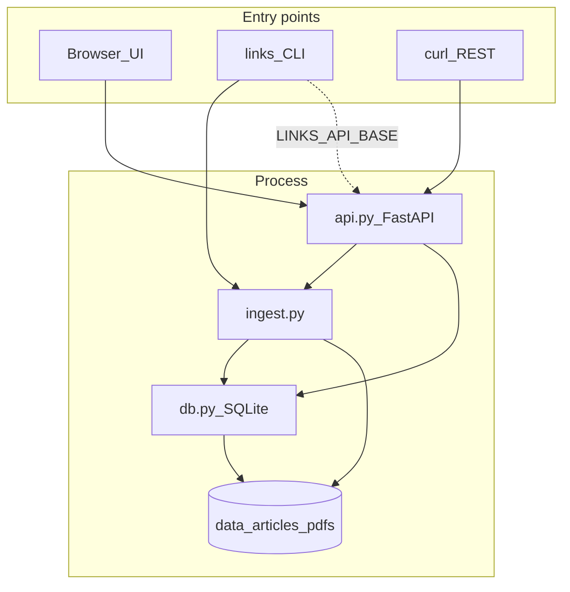

# Repository map — links_db

Local read-later app: **SQLite index** + **files on disk** for article HTML and PDFs, **FastAPI** (JSON API + Jinja/HTMX UI), **Typer CLI** (library mode or HTTP via `LINKS_API_BASE`).

---

## Directory tree (source of truth)

```
links_db/
├── README.md                 # Human usage (install, CLI, server, env vars)
├── REPO_MAP.md               # This file
├── AGENTS.md                 # Agent guide (Cursor / AI invariants, where to edit)
├── pyproject.toml            # Package metadata, deps, console script `links`
├── .gitignore                # Ignores data/, .venv/, __pycache__, etc.
├── skills-lock.json          # Unrelated Cursor lock file (safe to ignore)
├── .agents/skills/grill-me/  # Optional user skill; not part of app runtime
│
├── src/links_db/             # Installable Python package (setuptools `where = ["src"]`)
│   ├── __init__.py
│   ├── __main__.py           # `python -m links_db` → uvicorn on LINKS_HOST:LINKS_PORT
│   ├── settings.py           # pydantic-settings; env prefix LINKS_
│   ├── models.py             # Pydantic models + enums + row_to_item()
│   ├── db.py                 # SQLite schema, init_db(), list/get/insert/update/tags
│   ├── ingest.py             # HTTP fetch, PDF vs HTML, extract + nh3 sanitize; ingest_new_item, reingest_item
│   ├── api.py                # FastAPI app: REST + HTML routes; module-level Conn/St + Depends
│   ├── cli.py                # Typer entrypoint `links` → add/list/show/archive/open/tags/reingest
│   └── templates/            # Jinja2 (base, list, reader, item)
│
├── tests/
│   ├── fixtures/sample.html  # Offline HTML for extraction tests
│   ├── test_pdf_detection.py
│   ├── test_extraction.py
│   └── test_duplicates.py    # Uses MockTransport + patch on ingest._client
│
└── data/                     # Created at runtime (gitignored): links.db, articles/, pdfs/
```

---

## Request / data flow



- **Server:** `api.py` holds one SQLite connection on `app.state.conn` (lifespan). Routes call `db.*` and `ingest.*`.
- **CLI (default):** Opens its own connection per command; calls `ingest.ingest_new_item` directly (no server).
- **CLI (HTTP):** `httpx` to `LINKS_API_BASE` + same paths as REST.

---

## Module responsibilities

| File | Role |
|------|------|
| `settings.py` | `DATA_DIR`, DB path, host/port, fetch caps, UA, `reader_base_url`. |
| `models.py` | API schemas (`Item`, `ItemCreate`, `ItemPatch`, …), enums, `utc_now_iso()`, `row_to_item()`. |
| `db.py` | `SCHEMA`, `connect`, `init_db`, CRUD, tag union/replace, `list_items` filters + pagination + sort. |
| `ingest.py` | `_client()`, `_read_ingest_body()` (single `iter_bytes` pass), metadata + `extract_html_article`, `ingest_new_item`, `reingest_item`. |
| `api.py` | `create_app()` + `app`; **module-level** `get_conn`, `get_app_settings`, `Conn`, `St` (required with `from __future__ import annotations`). |
| `cli.py` | Typer `main` → `app()`; `_db_session` vs `_http()`. |
| `templates/*.html` | Inbox/archive list, reader, item detail; HTMX posts to REST for archive. |

---

## REST vs HTML routes (quick index)

| Method | Path | Kind |
|--------|------|------|
| POST | `/items` | JSON create/merge |
| GET | `/items` | JSON list + query filters |
| GET/PATCH | `/items/{id}` | JSON |
| GET | `/items/{id}/content` | HTML shell or PDF bytes |
| POST | `/items/{id}/archive`, `/reingest` | JSON |
| DELETE | `/items/{id}` | 204; `?hard=true` |
| GET | `/`, `/archive`, `/read/{id}`, `/item/{id}` | HTML |

---

## Pitfalls (for maintainers)

1. **`from __future__ import annotations` + FastAPI `Depends`:** Type aliases like `Conn = Annotated[..., Depends(...)]` must live at **module scope** in `api.py`, not inside `create_app()`, or FastAPI treats `conn` as a query param (422).
2. **`httpx` streaming:** Never call `response.iter_bytes()` twice on the same response; use one accumulator (see `_read_ingest_body` in `ingest.py`).
3. **Working directory / `LINKS_DATA_DIR`:** CLI and server must agree on data location or they read different DBs.
4. **`data/`:** User content; do not commit. Tests should use temp dirs or mocks.

---

## Commands

```bash
pip install -e '.[dev]'
pytest
python -m links_db          # serve UI + API
links add "https://…" --tags a,b
```

See [README.md](README.md) for full usage. Agent-oriented invariants and edit guidance: **[AGENTS.md](AGENTS.md)**.